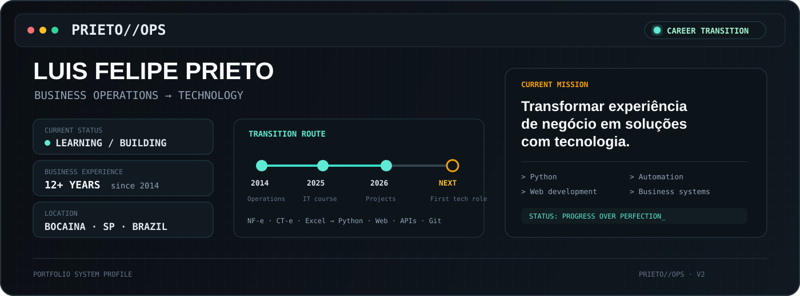

<p align="center">
  
</p>

<div align="center">

### De processos empresariais para tecnologia.

Sou **Luis Felipe Prieto**, profissional de faturamento com experiência desde **2014**,  
**Técnico em Informática** e atualmente em **transição de carreira para Tecnologia**.

[](https://www.linkedin.com/in/luisfelipeprieto1/)
[](https://github.com/LipePrieto)

</div>

---

## `01 // CONTEXTO`

Minha experiência profissional começou longe do código.

Trabalho com **faturamento e processos administrativos**, lidando com **NF-e, CT-e, MDF-e, boletos, relatórios, planilhas, documentos fiscais e rotinas empresariais**.

Foi justamente convivendo com processos repetitivos, sistemas e necessidades reais de empresas que comecei a me interessar cada vez mais por tecnologia.

Hoje estou construindo essa transição através de **estudo, experimentação e projetos próprios**.

> **Não estou tentando parecer um desenvolvedor experiente. Estou construindo a base para me tornar um.**

---

## `02 // ROTA`

```text
2014
  │
  ├── Faturamento
  ├── NF-e / CT-e / MDF-e
  ├── Excel
  └── Processos empresariais
  │
  ▼
2025
  │
  └── Técnico em Informática — SENAC Jaú
  │
  ▼
2026
  │
  ├── Python
  ├── Aplicações desktop
  ├── HTML / CSS / JavaScript
  ├── APIs
  ├── Banco de dados
  └── Git / GitHub
  │
  ▼
NEXT
  │
  └── Primeira oportunidade profissional em Tecnologia
```

---

## `03 // PROJETOS`

<table>
<tr>

<td width="33%" valign="top">

### 🔎 Consultador de CNPJ

Aplicação desktop criada para consultar e organizar dados empresariais por CNPJ.

**Python · CustomTkinter · API · PDF**

**Status:** `PORTFÓLIO`

[→ Abrir projeto](https://github.com/LipePrieto/consultador-cnpj-prieto)

</td>

<td width="33%" valign="top">

### 🍻 Avenida Pub

Cardápio digital responsivo desenvolvido para um estabelecimento real.

**HTML · CSS · JavaScript**

**Status:** `ONLINE`

[→ Abrir projeto](https://github.com/LipePrieto/cardapio-avenida-pub)

</td>

<td width="33%" valign="top">

### 🚗 Power Lava Car

Site comercial responsivo com serviços, cálculo de pacotes e integração com WhatsApp.

**HTML · CSS · JavaScript**

**Status:** `ONLINE`

[→ Abrir projeto](https://github.com/LipePrieto/PowerLavaCar)

</td>

</tr>
</table>

---

## `04 // STACK EM CONSTRUÇÃO`

<div align="center">
  
</div>

<br>

| Tecnologia / Área | Momento atual |
|---|---|
| Python | `ESTUDANDO` |
| HTML / CSS | `PRATICANDO` |
| JavaScript | `ESTUDANDO` |
| SQLite / Banco de Dados | `ESTUDANDO` |
| Git / GitHub | `PRATICANDO` |
| Processos administrativos | `12+ ANOS DE EXPERIÊNCIA` |

---

## `05 // COMO ESTOU APRENDENDO`

Utilizo ferramentas de **inteligência artificial como apoio** durante meus projetos.

Elas me ajudam principalmente a:

- transformar ideias em protótipos;
- gerar e revisar código;
- encontrar erros;
- testar alternativas;
- entender abordagens diferentes;
- acelerar o aprendizado.

Ao mesmo tempo, meu objetivo é **aumentar progressivamente minha compreensão e independência técnica**, estudando o código utilizado e fortalecendo fundamentos de programação.

---

## `06 // FORMAÇÃO`

```text
Técnico em Informática  ── SENAC Jaú
Técnico em Logística    ── SENAC
Excel Avançado          ── SENAI
Power BI                ── SENAC
```

---

## `07 // PRÓXIMA MISSÃO`

```text
> construir uma base sólida em desenvolvimento
> compreender cada vez mais o código que utilizo
> continuar criando soluções para problemas reais
> conquistar minha primeira oportunidade profissional em Tecnologia
```

Tenho interesse especialmente em **desenvolvimento de sistemas, automação de processos, aplicações desktop, desenvolvimento web e suporte a sistemas empresariais**.

---

<div align="center">

### `PRIETO//OPS`

**Business experience. Technology in progress. Solutions being built.**

</div>
